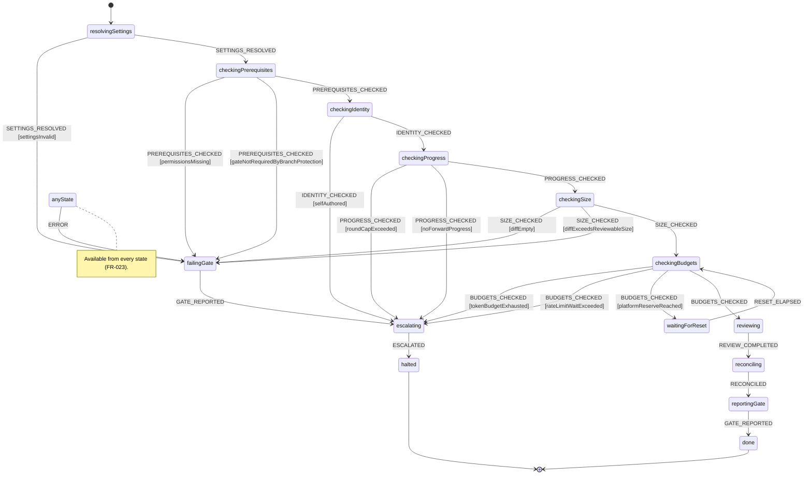

# Independent Review Service

A GitHub App and a local reconciling process that review every pull request in a named target
repository and gate its merge. Two reviewer roles — security and implementation — read the diff, post line-anchored findings
carrying severity and an explicit blocking status, and each conclude with a stated verdict. A check
run, which only a GitHub App can create, carries the combined outcome.

**Spec**: [specs/001-independent-review-service/spec.md](../specs/001-independent-review-service/spec.md).
That document records what was intended when it was written and is never rewritten. This one records
what is true now. The repository's entry point is the [README](../README.md), which routes to this
document, the [prerequisites checklist](prerequisites.md), and the spec.

> **Status: built and validated end to end; not yet operational on the target.** The code below is
> complete and all three test layers pass, including the full end-to-end suite driven against a real
> public fixture repository — every one of the 29 validation scenarios, with only the model boundary
> substituted. See [validation scenarios](#validation-scenarios).
>
> One thing remains, and it is configuration rather than code: on the **target** repository `main`
> is protected but its required status checks are empty, so `independent-review` is not a required
> check and the service correctly refuses to review under a gate nothing enforces. Adding that check
> is a human step, by design — an identity that could add it could remove it. See
> [human prerequisites](#human-prerequisites).

## How work is discovered

The service is a **long-lived local process that reconciles state**, not a workflow reacting to
events (R-017). Every `pollIntervalSeconds` it lists the open pull requests with a conditional
request — an unchanged listing answers `304` and costs no rate limit — and selects one when either
clause holds (R-018):

- **(a)** no `independent-review` check run exists for its head revision; or
- **(b)** one exists, it concluded `failure`, its output lists open blocking findings, and one of
  those findings has drawn a reply newer than that run's conclusion time.

Clause (b) is not an optimisation. FR-044 requires the service to judge a justification an author
offers *instead of* changing the code, which leaves the head revision exactly where it was — so
under clause (a) alone that pull request would be skipped on every tick forever, and the waiver
request and the no-progress detector would both be unreachable.

Level-triggered reconciliation has no missed-event class of bug, because it observes no events. A
laptop that slept for a week, a process killed mid-review, a crash between posting findings and
posting the gate: the next tick reads the same facts back from GitHub and converges. The process
holds nothing that outlives a tick except an `ETag`, and a stale `ETag` costs one wasted listing.

**A fork's pull request is reviewed like any other.** Nothing here executes anything the reviewed
tree contains — the code is read as data, a diff and a file listing, and the only program the
service runs against a checkout is `git`, with arguments the service chose. The exclusion the old
workflow needed is gone with the workflow.

## What it does

For each selected pull request, in order:

1. Resolves the target repository's constitution and operating settings **through an explicit
   `--target` parameter**, never through the working directory.
2. Verifies its own prerequisites before spending anything — the permissions it holds, that a model
   credential exists, and that its check run is a required check on the base branch.
3. Refuses to review its own work, an empty diff, an oversized diff, a stalled round, or a round past
   the cap — each with a stated reason and zero model spend.
4. Runs the security and implementation reviewers against the diff.
5. Posts each role's findings as one batched review, anchored to the offending line where the
   location is addressable and at pull-request level where it is not.
6. Reconciles against its own prior findings: resolves what the revision no longer exhibits, leaves
   standing what it does, adds what is new. It never reposts, and never resolves a finding it did
   not see fixed.
7. Re-reads the head revision immediately before posting, and discards its outcome if the author
   has pushed since — findings anchored to lines that have moved, and a gate for code nobody is
   proposing to merge, are worse than nothing (FR-019).
8. Reports a single check run: `success`, `failure` with a reason, or nothing at all.

Every push invalidates prior approvals, because the gate is recreated for the new head SHA and a
stale approval has nothing to attach to.

## How it works

### Control flow

The run is an XState statechart declared as data in [`src/review/machine.ts`](../src/review/machine.ts).
The diagram below is generated from that declaration by
[`scripts/generate-diagram.ts`](../scripts/generate-diagram.ts) and checked in `npm run check`, so it
cannot drift from the behavior.

<!-- BEGIN GENERATED STATECHART -->



<!-- END GENERATED STATECHART -->

`checkingPrerequisites` sits immediately after `resolvingSettings` because both verifications must
complete before any model tokens are spent, and because a gate nothing enforces makes every later
state pointless.

### The pieces

| Area | Module | Does |
|---|---|---|
| Addressing | [`config/target.ts`](../src/config/target.ts) | Resolves every path through `--target`; no `process.cwd()` fallback |
| Settings | [`config/settings.ts`](../src/config/settings.ts) | Validates the `reviewService` section strictly, ignores siblings |
| Model | [`model/client.ts`](../src/model/client.ts) | The one substitutable boundary; `anthropic.ts` and `scripted.ts` implement it |
| Platform | [`github/`](../src/github/) | App auth, pull request and diff reads, the check run, reviews, review threads, rate limits |
| Review logic | [`review/`](../src/review/) | Roles, rules, findings, locations, reconciliation, waivers, progress, precedence, the gate |
| Ledger | [`ledger/`](../src/ledger/) | Cumulative token spend with a reviewer reserve, reconstructible from check runs |
| Observability | [`observability/`](../src/observability/) | JSON-lines records with redaction; escalation |
| Composition | [`composition.ts`](../src/composition.ts) | The one place concrete adapters are constructed, and the review run they drive |
| Trigger | [`daemon.ts`](../src/daemon.ts) | The poll loop, the two-clause selection predicate, and the bounded workers |
| Checkout | [`worktree.ts`](../src/worktree.ts) | A bare mirror per target and a detached worktree per review, removed afterwards |
| Concurrency | [`host-lease.ts`](../src/host-lease.ts) | The host-wide agent cap, as a filesystem lease every agent takes |

### Two identities, and why the separation is structural

| Identity | Holds | Never holds |
|---|---|---|
| **Reviewing** — the App installation | `checks: write`, `pull_requests: write`, `contents: write`, `issues: write`, `administration: read` | Write on branch protection or administration |
| **Authoring** — used by later features | `contents: write` on feature branches | `checks: write` |

GitHub enforces the part that matters: **only GitHub Apps can create check runs.** An authoring
token cannot report this gate whatever scopes it carries. That is a platform guarantee, not a
convention this service maintains.

## How to run it

```bash
npm run check
```

Runs build, lint, format, types, the diagram check, unit tests, and integration tests — exactly what
CI runs, because a check that only exists in CI is prohibited.

```bash
node dist/cli.js --target owner/name --checkout /path/to/checkout --pull-request 42
```

A missing `--target` stops with an error rather than defaulting to the working directory.

That command reviews **one named pull request** and is the by-hand path. Ordinary operation is the
daemon, installed as a `launchd` user agent from
[`scripts/com.agents.review.plist`](../scripts/com.agents.review.plist):

```bash
npm run daemon -- --target owner/name --checkout /path/to/checkout
```

`RunAtLoad` and `KeepAlive` start it at login and restart it whenever it stops. A restart loses
nothing, which is the whole reason the trigger reconciles rather than listens. Install and uninstall
steps are in
[quickstart.md](../specs/001-independent-review-service/quickstart.md#install-the-service-r-017).

Settings live at `<target>/.agents/settings.json` under a `reviewService` section, validated against
[`schemas/settings.schema.json`](../schemas/settings.schema.json). Every budget, reserve, threshold
and cap is required; `modelEffort` is the one optional setting, and its effective value is reported
with every run.

## Decisions and trade-offs

**The model call is behind an interface** so end-to-end tests drive the entire flow with a scripted
double and nothing else mocked. Findings come back through structured outputs rather than prose, so
no test ever asserts on generated wording.

**A response is capped by the model's ceiling, and the budget reserves that cap.** A single response
may emit at most `MAX_OUTPUT_TOKENS` (16,000) -- the documented non-streaming ceiling that stays
inside the SDK's HTTP timeout -- and a caller asking for more is clamped rather than trusted, because
the failure otherwise arrives as a vague streaming error rather than as anything naming the
arithmetic. Deriving that ceiling from the token budget instead asked for 1.25M output tokens and the
SDK refused every call before sending it. The budget's side of the relationship is the paragraph
below: the reservation includes this cap, so a response can never emit more than was authorised.

**The budget reserves what a review costs, not a slice of the reserve.** Before a role runs, the
ledger is asked to authorise an estimate: the prompt -- dominated by the diff, which is already in
hand -- plus everything the response may emit. It replaced a per-role slice of
`reviewerTokenReserve`, which reserved over a million tokens for a review that spends tens of
thousands and could therefore refuse a run for failing to reserve capacity it was never going to
use. The estimate is approximate by design (four characters to a token, with a generous prompt
overhead): it exists to stop a run that cannot afford itself, and reserving slightly too much fails
safe where reserving too little does not.

**A finding's location arrives flat and becomes a union at the boundary.** Structured outputs rejects
`oneOf` -- "Schema type 'oneOf' is not supported" -- so the wire schema carries one object with a
`pullRequestLevel` discriminant and three fields that are ignored when it is set. `normalizeLocation`
restores the discriminated union, and everything downstream still sees `FindingLocation`.

That conversion is also where a location is *validated*, since a flat schema cannot require a
non-empty path on a field that pull-request-level findings leave blank. A location claiming a place
in the diff is downgraded to pull-request level when its path is empty, absolute, or contains a `..`
segment, or when its line is before the first. The finding survives either way -- a finding that
cannot be placed is still a finding (FR-014) -- but it never carries a path the service would not
have accepted. Traversal is refused here even though `config/target.ts` would refuse it later:
model output is untrusted data, and a guard that relies on something downstream catching it is one
refactor away from not being a guard.

A refusal is recorded rather than performed quietly: the adapter reports it and the composition root
writes a `location.rejected` record carrying the rejected path and the reason it failed. The event
is declared in `REVIEW_EVENTS`, and the record's `location` object -- `path` and `reason`, both
required -- is part of `schemas/review-record.schema.json`, which anything consuming the record
stream validates against. Two of the three rejection causes are ordinary model sloppiness; the third
is model output naming a path outside the checkout, and a security boundary that refuses something
without saying so leaves nothing to notice a pattern in (Principle VII).

**The gate never reports `neutral`, `skipped`, or `cancelled`.** GitHub treats the first two as
non-failing, which is exactly the absent gate that reads as no objection. Every inability to review
is a `failure` with a reason. A run still waiting reports nothing at all rather than reporting
something reassuring.

**Every tick that completes writes one record, whether or not it found work.** The daemon emits a `tick.completed`
record on each poll: whether the listing was a `304`, how many open pull requests the predicate
considered, how many it selected, and -- for each one it passed over -- the cheap condition that
excluded it (`no-reply-since-conclusion`, `gate-run-did-not-fail`, and so on).

The record is written once the tick's decisions are made. A tick that fails before that -- a listing
that throws, say -- currently records **nothing at all**: the exception propagates out of the loop,
and the heartbeat's guarantee does not extend to it. That is the same silent-exit gap described
below, and closing it means catching around the tick body so a failed tick logs and the loop
continues. It is separate work and it has not been done; an operator looking for evidence of a
crashed tick will not find any here.

The counts go out on every tick that completes; the per-pull-request list is written only when it
differs from the tick before. A repository with a steady set of open pull requests would otherwise multiply that set
into the record stream once a minute forever, and the JSONL cache is disk, which Principle IV meters
like anything else. The unchanging detail carries nothing the previous tick did not; the counts are
what prove the loop is alive, so those always go.

Reading the list therefore needs one convention: an absent list means "unchanged since it was last
written", never "nothing was skipped" -- those are different facts, and `skipped: []` states the
second one explicitly. A `304` tick omits the list rather than claiming an empty one, because it
examined no listing and so learned nothing about what is being passed over. Its `considered` and
`selected` are both `0` for the same reason — they report what this tick examined, not what is open —
so a `304` and a tick over an empty repository read alike in the counts and are told apart by
`unchanged`.

It is the only unconditional record the service writes, and it exists because everything else is
conditional. A tick that selects nothing used to log nothing, so a daemon idling correctly and a
daemon that had died produced identical output: none. That is not hypothetical -- one ran for
twenty-four minutes, exited, and recorded neither the idling nor the exit; the only way to tell the
difference at any point was `ps`. A level-triggered design makes a crash cheap to recover from, but
only if somebody finds out about it. The record costs nothing against the platform budget: a `304`
is free, and this is not a request at all.

**State lives on GitHub, not on disk.** Round history, spend, and the excluded-path count are written
into each round's check-run output, so the next round rebuilds them from GitHub alone. The local
JSONL ledger is a cache; a disagreement between the two escalates rather than being silently
corrected.

**Exclusions are declared, never inferred.** The excluded set is what git reports as binary plus the
configured `excludedPathPatterns`, and nothing else. A generated-file heuristic cannot be audited and
can silently over-match — dropping real source from the changed-line count and quietly shrinking a
pull request under the size cap.

**Progress is measured by revision and reply, never by elapsed time.** A slow author is not a stalled
one. An unconcluded round is ignored entirely as a baseline, which is what stops a retry after a
crash from being mistaken for an author who pushed nothing.

**The service verifies branch protection; it never configures it.** An identity that can write branch
protection can remove its own gate.

**The concurrency cap counts every agent on the machine, not this process's own workers.** It is a
filesystem lease — `slot-01 … slot-NN` under `${XDG_STATE_HOME:-~/.local/state}/agents/slots/`,
taken with `open(O_CREAT | O_EXCL)` — because a number one process holds in memory cannot satisfy a
cap that is "global across every in-flight feature and task combined". A `/speckit-implement` task,
a local CI run, and a review would each stay inside their own limit while three of them ran against
a cap of two. `reviewService.maxConcurrentReviews` survives as a ceiling on the reviewer's *share*
of that cap; a review holds both before it starts (R-019).

**The fork exclusion is gone, and that is a consequence of the topology rather than a relaxation.**
The previous design ran `npm ci` and `npm run build` against the pull request's own code on the
host, which is why the workflow was gated on
`github.event.pull_request.head.repo.full_name == github.repository`. Nothing executes the reviewed
tree any more, so the guard has nothing left to protect. The repository's fork pull-request approval
policy remains set to `all_external_contributors` for CI, which is a separate workflow with separate
reasons.

### Two least-privilege tensions, recorded rather than hidden

- **`contents: write`** — resolving a review thread is available only through the GraphQL
  `resolveReviewThread` mutation, which requires it. There is no REST equivalent: review threads are
  not exposed there at all. Without it, reconciliation is unimplementable and the comment history
  grows without bound.
- **`administration: read`** — verifying the gate is a required check needs it. The corresponding
  *write* is precisely what the installation must never hold.

### What is deliberately deferred

Process-level containment — filesystem scope, per-agent CPU and memory limits, restricted egress —
is **not** implemented. The constitution requires the sandboxing runtime to be settled by a file-I/O
spike on the host platform before adoption, and that spike is not this feature. What is *not*
deferred is the part achievable through permissions: the reviewing identity structurally cannot
merge, cannot push, and cannot alter branch protection.

## Human prerequisites

Some things must be set up before the service can run against a real pull request, and none of them
can be done by the service — an identity that can provision its own gate can remove it.

**[docs/prerequisites.md](prerequisites.md) is the checklist**, with the current state of each, the
order to do them in, and the reasoning. In summary:

| # | Prerequisite | State |
|---|---|---|
| 1 | GitHub App — the reviewing identity | Created and installed on the target |
| 2 | Model credential on the developer machine, never in Actions secrets — an `ant auth login` profile | Provisioned |
| 3 | Fork CI blocking | Done |
| 4 | ~~Self-hosted runner, labelled `agents-host`~~ | **Removed.** No runner is registered; the host cap is a lease (R-017, R-019) |
| 5 | Branch protection requiring `independent-review` on the **target** | Available, **not configured** |
| 6 | Fixture repository for the e2e suite | **Done** — [`OneHedgehog/fixture-repo-ad`](https://github.com/OneHedgehog/fixture-repo-ad), public, seeded, App installed, gate required on `main` |

None of these block `npm run check`. Item 6 previously blocked every `tests/e2e/**` task and no
longer does: the fixture was created and seeded on 2026-08-27 and its gate was made a required check
on 2026-08-28, and the suite has run green against it since.

Item 5 is the last one open, and it blocks **real operation only**. The service verifies it on every
run and never writes it, so until a human adds `independent-review` to the target's required status
checks, every review of a target pull request will stop at its prerequisite check, spend nothing,
and escalate — which is the designed behaviour rather than a defect.

## The merge gate

[`github/branch-protection.ts`](../src/github/branch-protection.ts) reads the base branch's
protection and [`review/prerequisites.ts`](../src/review/prerequisites.ts) asserts that the
`independent-review` check appears in its required status checks — both before any model tokens are
spent. The service **verifies and never configures**: configuring would need `administration:
write`, and an identity that can write branch protection can remove its own gate.

**Verified 2026-08-24**: `main` is protected — the endpoint returns `200`, superseding the `404
Branch not protected` recorded earlier — but its `required_status_checks.contexts` and `.checks` are
both empty, so `isGateRequired` returns `false` and the service still fails its own prerequisite
check. Making the gate real remains a human step: add `independent-review` to the branch's required
status checks.

Four responses, four meanings — and two of them share a status code:

| Response | Means | Reported as |
|---|---|---|
| `200` | Protected; read `required_status_checks.contexts` | Pass if the gate is listed |
| `404` | The branch is unprotected | The failure case — never an error to retry |
| `403` `Resource not accessible by …` | The grant really is missing | Missing `administration: read` |
| `403` `Upgrade to GitHub Pro or make this repository public…` | The plan does not offer the feature; the grant may well be held | A plan limitation, explicitly **not** a permission fault |

That last distinction was verified against this repository while it was private on GitHub Free: the
token **held** `administration: read` — `/keys`, `/autolinks`, `/actions/permissions` and
`/actions/runners` all returned `200` — and still got `403` on `/branches/main/protection`.
Reporting it as a missing permission sends an operator hunting a grant they already have. The
repository is public now, so this path no longer fires here, but it remains correct for any private
target.

## Test layers

| Layer | Model | Gates merge | Status |
|---|---|---|---|
| Unit | Not invoked | Yes | 648 tests passing |
| Integration | Not invoked | Yes | 88 tests passing |
| End-to-end | Scripted double | Yes (`test:e2e`, run separately) | 48 tests passing against the live fixture |

End-to-end tests exercise real git, real branches, real pull requests, with only the model boundary
substituted. They assert on states entered, comments posted, verdicts recorded, gate conclusion, and
escalations — never on generated wording, which a lint rule over `tests/e2e/` enforces rather than
leaving to discipline.

`npm run check` deliberately runs the first two layers and not the third. The end-to-end suite talks
to GitHub, consumes a shared API allowance, and takes minutes; folding it into the command run on
every change would make the fast layers as slow as the slowest one and would couple a local edit to
the availability of a remote service. It is run on its own, by `npm run test:e2e`.

## Validation scenarios

All 29 of the [quickstart](../specs/001-independent-review-service/quickstart.md) validation
scenarios have been run against the live fixture repository
[`OneHedgehog/fixture-repo-ad`](https://github.com/OneHedgehog/fixture-repo-ad) and pass, along with
the two suite-level criteria. **Recorded 2026-08-28.**

Each drives the real composition root against a real pull request, with `ScriptedModelClient`
substituted at the model boundary and nothing else replaced.

| # | Scenario | Where | Result |
|---|---|---|---|
| 1 | Clean pull request | [`gating-verdict.e2e.ts`](../tests/e2e/gating-verdict.e2e.ts) | Pass |
| 2 | Hardcoded credential | [`findings.e2e.ts`](../tests/e2e/findings.e2e.ts) | Pass |
| 3 | Behavior change with no `docs/` update | [`constitutional-rules.e2e.ts`](../tests/e2e/constitutional-rules.e2e.ts) | Pass |
| 4 | Unrelated refactor in the diff | [`constitutional-rules.e2e.ts`](../tests/e2e/constitutional-rules.e2e.ts) | Pass |
| 5 | Oversized pull request, unjustified | [`constitutional-rules.e2e.ts`](../tests/e2e/constitutional-rules.e2e.ts) | Pass |
| 6 | Same, justified in the description | [`constitutional-rules.e2e.ts`](../tests/e2e/constitutional-rules.e2e.ts) | Pass |
| 7 | Push after approval | [`staleness.e2e.ts`](../tests/e2e/staleness.e2e.ts) | Pass |
| 8 | Re-review: one fixed, one standing, one new | [`staleness.e2e.ts`](../tests/e2e/staleness.e2e.ts) | Pass |
| 9 | Justification rejected | [`waivers.e2e.ts`](../tests/e2e/waivers.e2e.ts) | Pass |
| 10 | Justification accepted → waiver request | [`waivers.e2e.ts`](../tests/e2e/waivers.e2e.ts) | Pass |
| 11 | Re-trigger with no progress | [`progress.e2e.ts`](../tests/e2e/progress.e2e.ts) | Pass |
| 12 | Retry after a crashed round | [`progress.e2e.ts`](../tests/e2e/progress.e2e.ts) | Pass |
| 13 | Model credential absent, and a mid-run error | [`fail-closed.e2e.ts`](../tests/e2e/fail-closed.e2e.ts) | Pass |
| 14 | Budget exhausted | [`budget.e2e.ts`](../tests/e2e/budget.e2e.ts) | Pass |
| 15 | Budget drawn to the reviewer reserve | [`budget.e2e.ts`](../tests/e2e/budget.e2e.ts) | Pass |
| 16 | Diff over `maxReviewableDiffSize` | [`fail-closed.e2e.ts`](../tests/e2e/fail-closed.e2e.ts) | Pass |
| 17 | Platform reserve reached | [`rate-limit.e2e.ts`](../tests/e2e/rate-limit.e2e.ts) | Pass — **required new code**, see below |
| 18 | Self-authored pull request | [`self-review.e2e.ts`](../tests/e2e/self-review.e2e.ts) | Pass — **found a real defect**, see below |
| 19 | Authoring identity attempts the gate | [`gate-identity.e2e.ts`](../tests/e2e/gate-identity.e2e.ts) | Pass |
| 20 | Security blocks what implementation accepts | [`gating-verdict.e2e.ts`](../tests/e2e/gating-verdict.e2e.ts) | Pass |
| 21 | Escalation reaches both surfaces | [`escalation.e2e.ts`](../tests/e2e/escalation.e2e.ts) | Pass |
| 22 | A concluded run is reconstructible | [`accountability.e2e.ts`](../tests/e2e/accountability.e2e.ts) | Pass |
| 23 | Run from an unrelated working directory | [`addressing.e2e.ts`](../tests/e2e/addressing.e2e.ts) | Pass |
| 24 | Host cap full, wait under the maximum | [`queue.e2e.ts`](../tests/e2e/queue.e2e.ts) | Pass |
| 25 | Queue wait over the maximum | [`queue.e2e.ts`](../tests/e2e/queue.e2e.ts) | Pass — **required new code**, see below |
| 26 | Gate not required, and a missing permission | [`prerequisites.e2e.ts`](../tests/e2e/prerequisites.e2e.ts) | Pass |
| 27 | Empty or whitespace-only diff | [`empty-diff.e2e.ts`](../tests/e2e/empty-diff.e2e.ts) | Pass |
| 28 | Sibling section, unknown own key, absent optional | [`settings.e2e.ts`](../tests/e2e/settings.e2e.ts) | Pass |
| 29 | Excluded and binary paths | [`excluded-paths.e2e.ts`](../tests/e2e/excluded-paths.e2e.ts) | Pass |
| SC-010 | No assertion on generated wording | `eslint-rules/no-generated-content-assertions.js` | Enforced by lint |
| SC-013 | 1,000 changed lines within ten minutes | [`performance.e2e.ts`](../tests/e2e/performance.e2e.ts) | Pass |

### What running them actually found

The suite was worth running rather than merely worth having, and three of the twenty-nine scenarios
are the reason.

**Scenario 18 found a real defect.** The self-review refusal compared the pull request's author
against `` `${repository.name}[bot]` `` — the *repository's* name — rather than against the App's
own login. Those two strings coincide only by accident, and where they differ the check silently
never fires: the service reviewed a pull request it had authored itself, and the only thing that
stopped it was GitHub refusing to let an author request changes on their own pull request, several
API calls and a full model spend later. FR-004's independence had collapsed in exactly the quiet way
it was written to prevent. The reviewing identity is now read from the installation itself — the
`app_slug` GitHub reports alongside the installation id — and carried on `ServiceAdapters`. Pinned at
the integration layer too, with the App's login and the repository's name deliberately different.

**Scenario 17 required code that did not exist.** FR-040's pause-and-resume behaviour had a module
(`github/rate-limit.ts`) and a settings pair, and nothing ever called them: the composed flow made no
allowance check at all. It does now, between the token-budget check and opening the gate, reading the
live remaining figure from GitHub rather than counting locally — the allowance refills, and a local
counter has no way to know when.

**Scenario 25 required code that could not fire.** `measureQueueWait` existed and was measured from a
`queuedAt` re-stamped on every tick, so the wait could only ever be one tick long and FR-041's
maximum was unreachable however saturated the machine. The daemon now remembers when each review
first entered the queue, keyed by pull request *and* revision so a push starts a fresh wait, and an
exceeded wait now reports a failing gate and escalates rather than only writing a log line.
